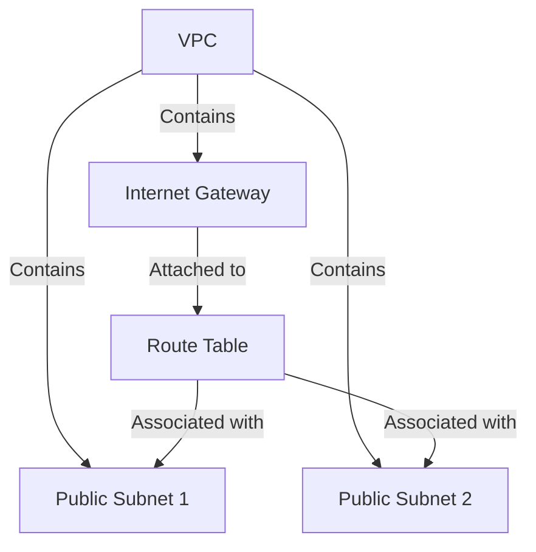
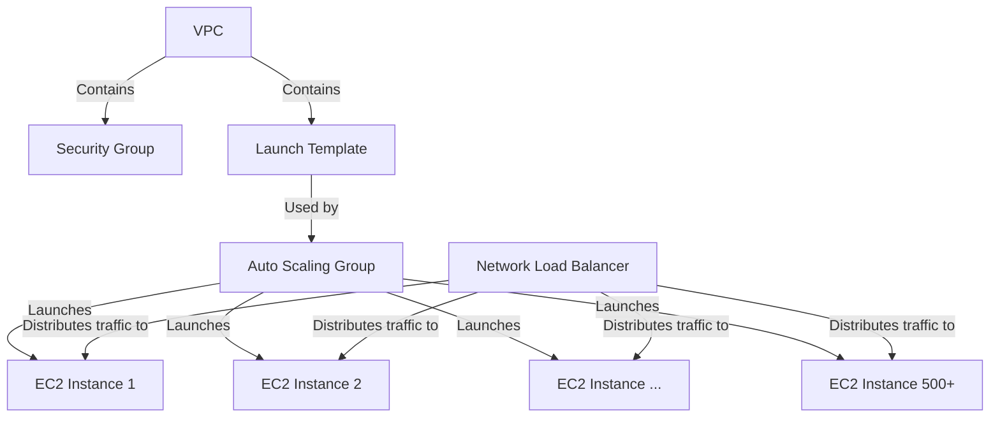
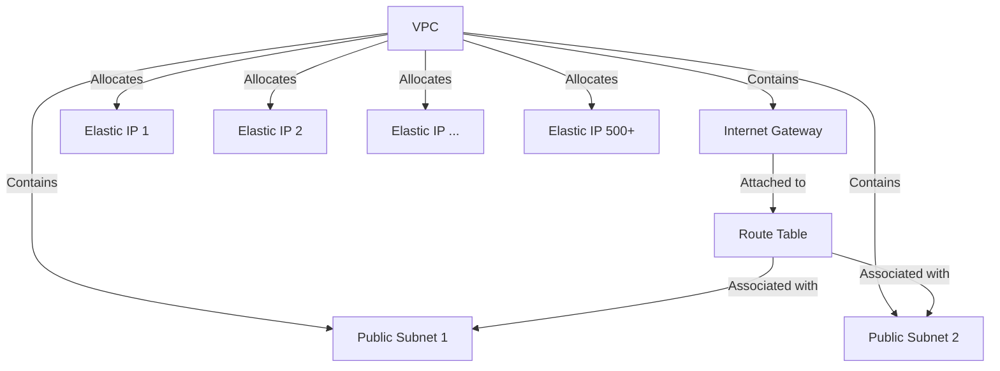
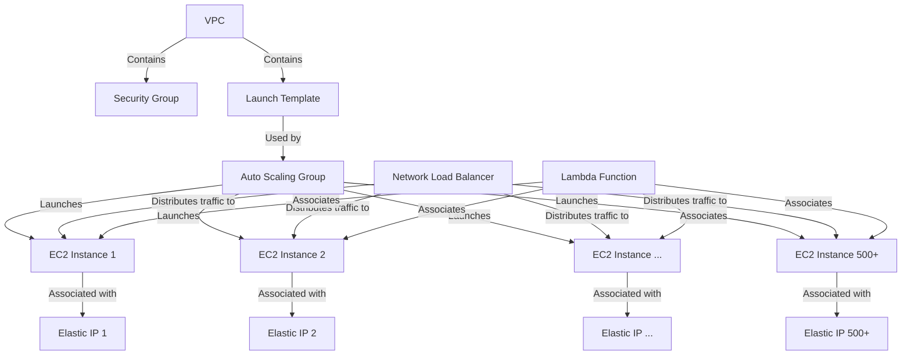

# Proxy Networks

This project aims to create a proxy network of 500+ AWS EC2 instances running Squid proxy servers, using both dynamic and static IP configurations.

This proxy network can be useful for various applications, such as web scraping, load testing, or anonymizing traffic. The project provides two setup options: dynamic IP and static IP, allowing users to choose the configuration that best suits their needs. Additionally, this infrastructure can be adapted for email server deployments, where multiple IP addresses may be beneficial for: 

- Handling large email volumes
- Segmenting email streams
- Providing network redundancy

The dynamic IP setup uses auto-assigned public IP addresses, which may change if instances are stopped and started. The static IP setup uses Elastic IPs, providing consistent IP addresses for each proxy instance. Choose the setup that best fits your use case and requirements.

## Infrastructure as Code

This project primarily uses [Pulumi](https://www.pulumi.com/) to define, deploy, and test the infrastructure. AWS CloudFormation templates are provided as an alternative option.

### Pulumi Infrastructure Code

Located in the [`src`](src/) directory:

- [`dynamic_infrastructure.py`](src/dynamic_infrastructure.py): Pulumi code for dynamic IP setup
- [`static_infrastructure.py`](src/static_infrastructure.py): Pulumi code for static IP setup
- [`test_infrastructure.py`](src/test_infrastructure.py): Unit tests for the infrastructure code

The Pulumi scripts include comprehensive unit tests to ensure the correctness and reliability of the infrastructure deployment. These tests cover various aspects such as resource creation, configuration, and dependencies.

#### Python Environment Setup

Before running the Pulumi scripts, set up your Python environment:

```bash
# Create a virtual environment
python -m venv .venv

# Activate the virtual environment
source .venv/bin/activate

# Install required packages
pip install --upgrade pip
pip install -r requirements.txt
```

#### Running Tests

To run the tests:

```bash
python -m pytest
```

#### Deploying Infrastructure

To deploy the Pulumi infrastructure code, use the following commands:

```bash
# For dynamic IP setup
pulumi up -c src.dynamic_infrastructure

# For static IP setup
pulumi up -c src.static_infrastructure
```

Note: Ensure you have configured your AWS credentials properly before running these commands. You can do this by setting up the AWS CLI or by configuring Pulumi to use your AWS credentials.

### AWS CloudFormation Templates (Alternative)

Located in the [`aws-cloudformation-templates`](aws-cloudformation-templates/) directory:

- [`vpc-template-dynamic.yaml`](aws-cloudformation-templates/vpc-template-dynamic.yaml): VPC template for dynamic IP setup
- [`vpc-template-static.yaml`](aws-cloudformation-templates/vpc-template-static.yaml): VPC template for static IP setup
- [`proxy-infrastructure-dynamic.yaml`](aws-cloudformation-templates/proxy-infrastructure-dynamic.yaml): Proxy infrastructure template for dynamic IP setup
- [`proxy-infrastructure-static.yaml`](aws-cloudformation-templates/proxy-infrastructure-static.yaml): Proxy infrastructure template for static IP setup

## Infrastructure Diagrams

### Dynamic IP Setup - VPC



### Dynamic IP Setup - Proxy Infrastructure



### Static IP Setup - VPC



### Static IP Setup - Proxy Infrastructure



## AWS-Related Information

### Deploying Infrastructure Using AWS CloudFormation

To deploy the VPC templates, use the following AWS CLI commands:

```bash
# For dynamic IP setup
aws cloudformation create-stack \
--stack-name proxy-vpc-dynamic \
--template-body file://aws-cloudformation-templates/vpc-template-dynamic.yaml

# For static IP setup
aws cloudformation create-stack \
--stack-name proxy-vpc-static \
--template-body file://aws-cloudformation-templates/vpc-template-static.yaml \
--parameters ParameterKey=NumberOfProxies,ParameterValue=500
```

To deploy the proxy infrastructure templates, use the following AWS CLI commands:

```bash
# For dynamic IP setup
aws cloudformation create-stack \
--stack-name proxy-infrastructure-dynamic \
--template-body file://aws-cloudformation-templates/proxy-infrastructure-dynamic.yaml \
--parameters ParameterKey=VpcId,ParameterValue=<vpc-id> ParameterKey=PublicSubnet1,ParameterValue=<subnet1-id> ParameterKey=PublicSubnet2,ParameterValue=<subnet2-id> ParameterKey=KeyName,ParameterValue=<key-pair-name> \
--capabilities CAPABILITY_IAM

# For static IP setup
aws cloudformation create-stack \
--stack-name proxy-infrastructure-static \
--template-body file://aws-cloudformation-templates/proxy-infrastructure-static.yaml \
--parameters ParameterKey=VpcId,ParameterValue=<vpc-id> ParameterKey=PublicSubnet1,ParameterValue=<subnet1-id> ParameterKey=PublicSubnet2,ParameterValue=<subnet2-id> ParameterKey=KeyName,ParameterValue=<key-pair-name> ParameterKey=ElasticIPs,ParameterValue=<comma-separated-eip-allocation-ids> ParameterKey=NumberOfProxies,ParameterValue=500 \
--capabilities CAPABILITY_IAM
```

### AWS CLI Installation

#### macOS

For macOS users, the easiest way to install the AWS CLI is using Homebrew:

```bash
brew install awscli
```

After installation, verify it's working correctly:

```bash
aws --version
```

This should display the version of the AWS CLI installed on your system.

#### Other Operating Systems

For non-macOS systems or if you prefer not to use Homebrew, you can install the AWS CLI from the official URL:

https://docs.aws.amazon.com/cli/latest/userguide/getting-started-install.html

After installing the AWS CLI, configure your AWS credentials by running `aws configure` and following the prompts to enter your AWS Access Key ID, Secret Access Key, default region, and output format.

### Notes

#### Setup and Configuration
- Replace `<vpc-id>`, `<subnet1-id>`, `<subnet2-id>`, `<key-pair-name>`, and `<comma-separated-eip-allocation-ids>` with appropriate values from your VPC stack, EC2 key pair, and VPC stack output (ElasticIPs).
- This setup creates an Auto Scaling Group with 500 EC2 instances, each running a Squid proxy server.
- The Network Load Balancer distributes traffic across these instances.
- Replace the `ImageId` in both `proxy-infrastructure-dynamic.yaml` and `proxy-infrastructure-static.yaml` with your custom AMI ID.
- Launching 500+ EC2 instances and using 500+ Elastic IPs (for static IP setup) requires an increase in AWS account limits. Contact AWS support for these limit increases.

#### IP Configuration
- For the static IP setup, the Lambda function associates Elastic IPs with EC2 instances automatically.
- The dynamic IP setup uses auto-assigned public IP addresses, which may change if instances are stopped and started.
- Both setups use a Network Load Balancer for distributing traffic.
- The static IP setup provides consistent IP addresses for each proxy instance.
- To verify and test the proxy network, use the Load Balancer's DNS name as your proxy address with port 3128.

#### Troubleshooting
- If you encounter deployment issues, check the AWS CloudFormation console for error messages and stack events.
- Ensure your AWS account has the necessary permissions to create the required resources.
- For non-working proxies, check EC2 instance logs and Squid logs for error messages.
- For the static IP setup, verify that the Lambda function is correctly associating Elastic IPs with EC2 instances.
- If you're having connection issues, ensure your client is correctly configured to use the Load Balancer's DNS name and port 3128.

### Cost Estimates

#### Monthly Costs

| Component | Details | Monthly Cost |
|-----------|---------|--------------|
| EC2 Instances | 500 t3.micro instances in US East (N. Virginia)<br>On-Demand price: $0.0104 per hour<br>500 * $0.0104 * 24 hours * 30 days | $3,744 |
| Elastic IPs (Static IP setup only) | First IP free, additional IPs: $0.005 per hour<br>499 * $0.005 * 24 hours * 30 days | $1,797 |
| Network Load Balancer | $0.0225 per hour + $0.006 per LCU-hour<br>Assuming moderate usage: $0.0225 * 24 * 30 + (500 * $0.006 * 24 * 30) | $2,160 |
| Data Transfer | Varies greatly depending on usage<br>Outbound data transfer starts at $0.09 per GB (first 10 TB) | Variable |
| Lambda Function (Static IP setup only) | Likely minimal cost due to infrequent invocations | Minimal |

#### Total Monthly Costs

| Setup Type | Estimated Monthly Cost |
|------------|------------------------|
| Dynamic IP | $5,904 |
| Static IP  | $7,701 |

Disclaimer: These are rough estimates and actual costs may vary based on usage, data transfer, and other factors. These estimates exclude data transfer costs, which can vary significantly based on usage.

### Recommendations

#### Cost Optimization
1. Consider using Reserved Instances or Spot Instances to significantly reduce EC2 costs.
2. Implement auto-scaling to optimize costs during periods of low usage.
3. Regularly analyze usage patterns and costs using AWS Cost Explorer.

#### Performance and Efficiency
1. Create a custom AMI with Squid pre-installed for faster instance launches.
2. Use Target Tracking Scaling policies to adjust the number of instances based on metrics like CPU utilization or network throughput.
3. Implement a custom health check for the Load Balancer to ensure it only routes traffic to fully operational proxy servers.

#### Management and Maintenance
1. Regularly update the Squid proxy software and the underlying OS to maintain security.
2. Implement logging and monitoring solutions to track proxy usage and performance.
3. Use AWS Systems Manager Parameter Store to manage configuration values.

#### Advanced Optimization
1. Consider using Spot Instances instead of On-Demand Instances for non-critical workloads.
2. Implement caching strategies to reduce bandwidth usage and improve response times.
3. Consider using AWS Global Accelerator for improved global network performance.

#### Security Recommendations
1. Implement proper access controls to restrict usage of the proxy network to authorized users only.
2. Encrypt traffic between clients and the proxy servers using SSL/TLS.
3. Regularly monitor proxy usage for any suspicious activities or abuse, and implement rate limiting.

## Project Structure

- [`src/`](src/): Contains the Pulumi infrastructure code
  - [`dynamic_infrastructure.py`](src/dynamic_infrastructure.py): Defines the dynamic IP setup
  - [`static_infrastructure.py`](src/static_infrastructure.py): Defines the static IP setup
- [`tests/`](tests/): Contains unit tests for the infrastructure code
  - [`test_dynamic_infrastructure.py`](tests/test_dynamic_infrastructure.py): Tests for dynamic IP setup
  - [`test_static_infrastructure.py`](tests/test_static_infrastructure.py): Tests for static IP setup
- [`aws-cloudformation-templates/`](aws-cloudformation-templates/): Contains AWS CloudFormation templates
  - [`vpc-template-dynamic.yaml`](aws-cloudformation-templates/vpc-template-dynamic.yaml): VPC template for dynamic IP setup
  - [`vpc-template-static.yaml`](aws-cloudformation-templates/vpc-template-static.yaml): VPC template for static IP setup
- [`requirements.txt`](requirements.txt): Lists the Python package dependencies
- [`.gitignore`](.gitignore): Specifies intentionally untracked files to ignore

## About Slava Kurilyak

Built AI agents for clients as founder of [TeamX](https://teamx.work). Created [Produvia](https://produvia.com) as an AI agency. Developed proxy networks for scalable web operations and wrote infrastructure-as-code for cloud deployments (this project). Won hackathons as a full-stack developer. 

Interested to hire Slava for your next project? [Contact him here](https://cal.com/slavakurilyak/discovery-call).